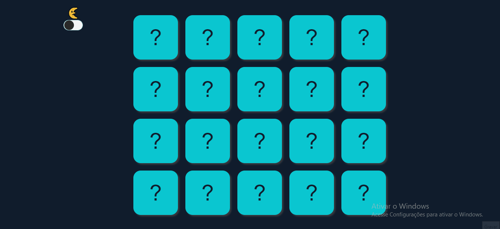
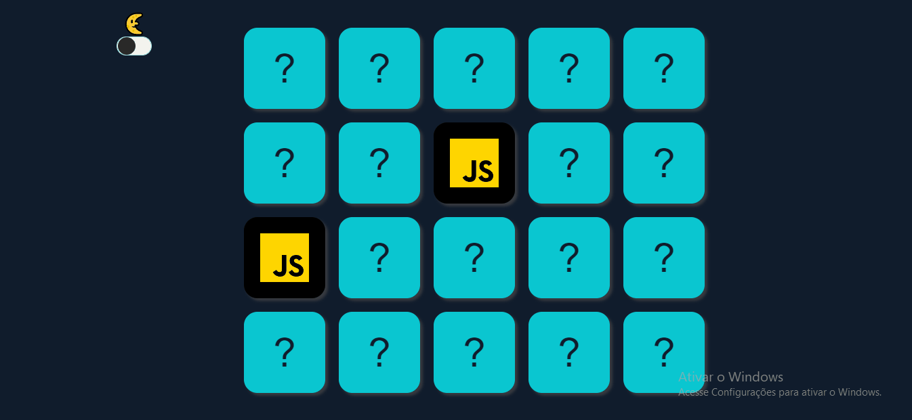

<h1 align="center" size="200px">Jogo da memória<h1>

Fiz esse jogo para colocar meus conhecimentos em Pratica

<h1 > Features</h1>

✅ O algoritimo cria as cartas automaticamente.

✅ O algoritimo embaralhar as cartas automaticamente.

✅ Possui um LockMode.

✅ Avança de nivéis.

✅ pussui dark mode.

<h2 color="blue" align="center">
<a href="https://VitorHRD.github.io/Jogo-da-Memoria/">🔗 Jogar</a>
</h2

<h2 align="center">Cartar virando e formando pares<h2>
</img>
<h2 align="center">Dark mode e light mode<h2>
</img>
